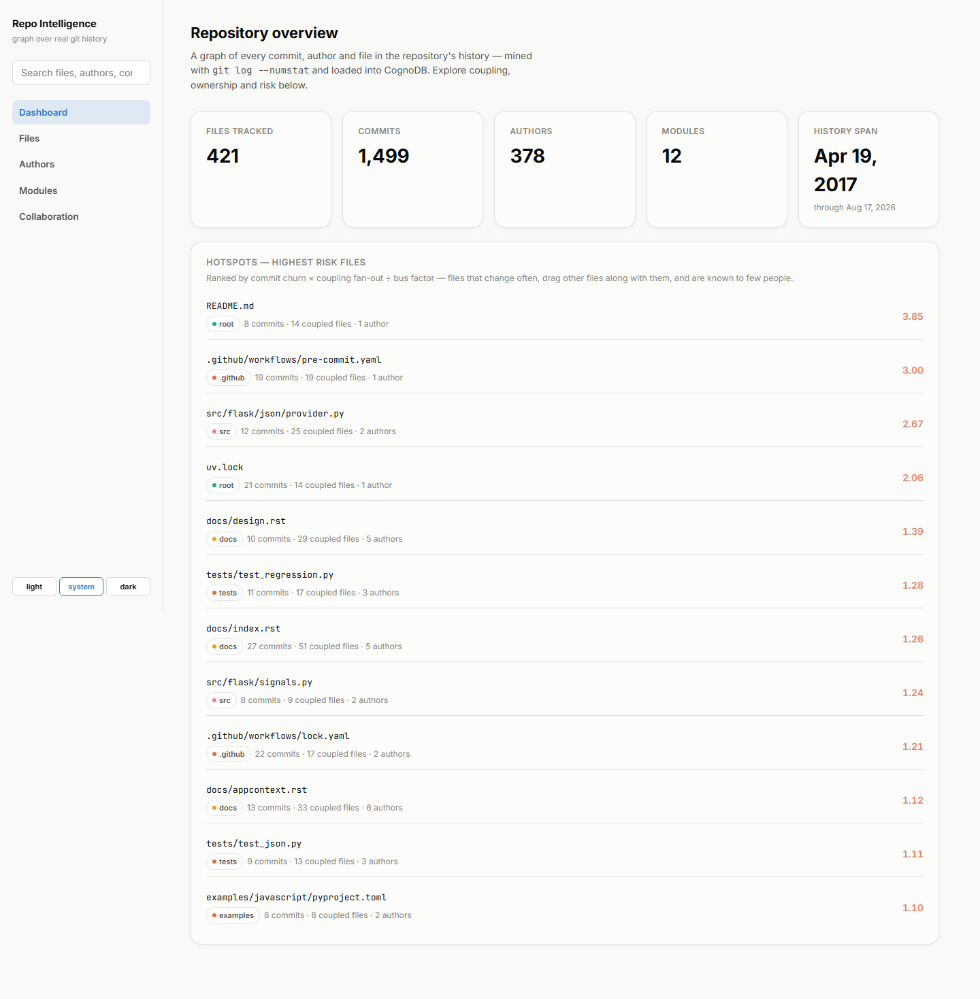
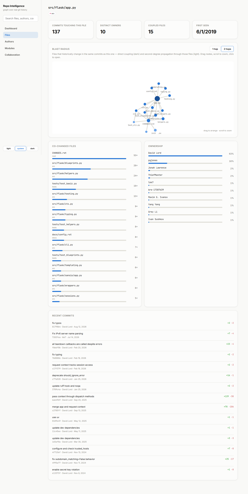
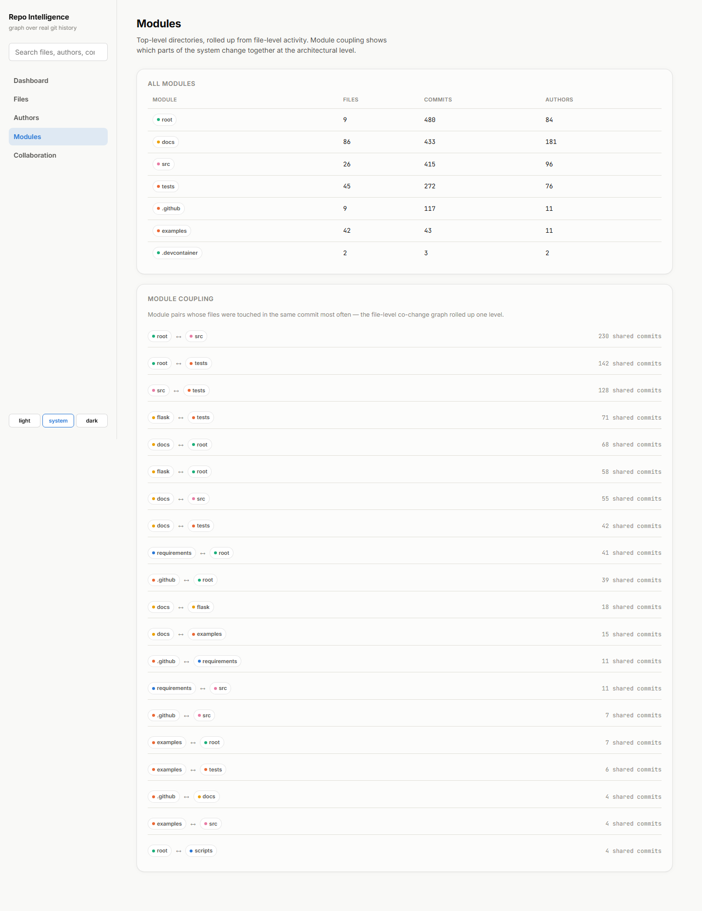
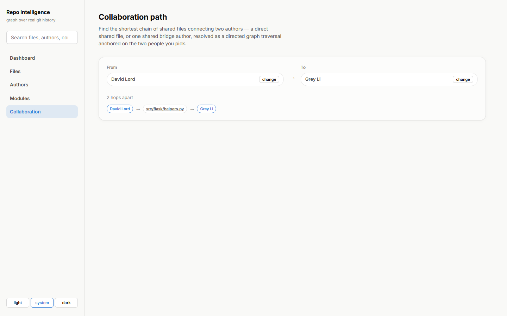
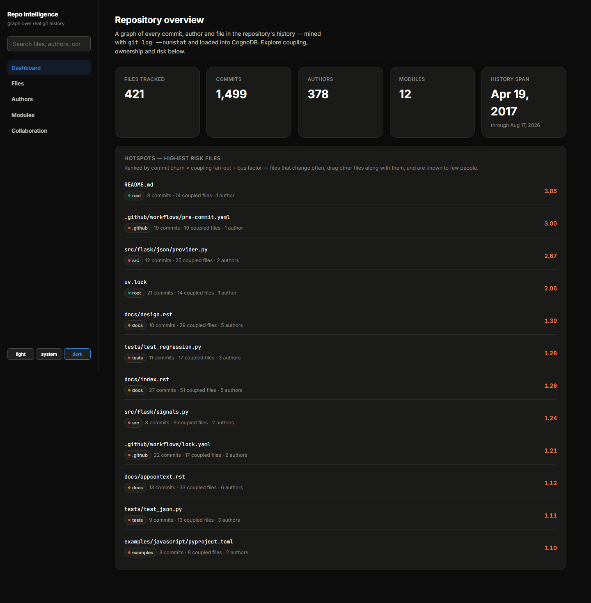
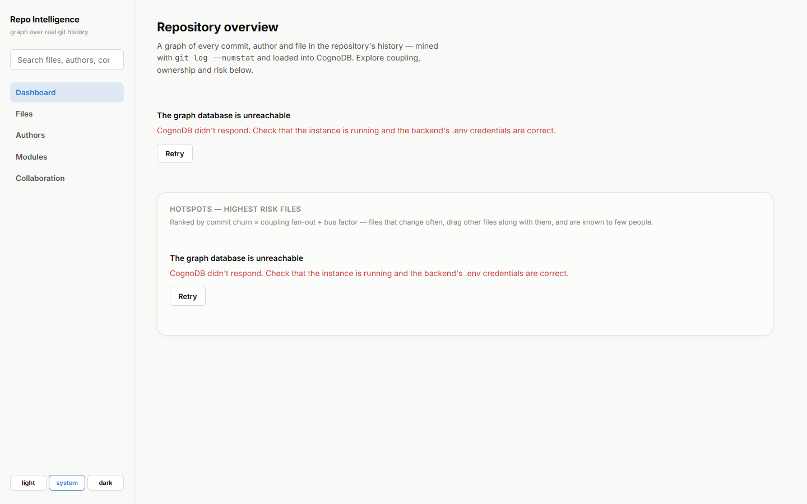
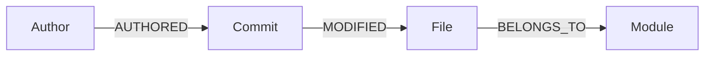

# Repo Intelligence Graph

Explore a codebase's **hidden coupling, hotspots, and ownership** — not from its
file tree, but from its real git history, modeled as a graph in CognoDB.

Point it at any public git repository, mine the commit log, and ask questions
no relational schema answers comfortably: *"If I touch this file, what else
tends to break?" "Who actually owns this module?" "How do these two
contributors connect through the code they've both touched?"*

## Why a graph database?

Every interesting question here is a **relationship traversal over a
commit-x-file fact table**, not a lookup:

- **Logical coupling** ("files that change together") is a 2-hop pattern —
  `File → Commit → File` — aggregated and thresholded. In SQL this is a
  self-join of a potentially huge `file_changes` table against itself on
  `commit_id`, which gets slow and awkward fast, especially once you want to
  go a second degree out (coupling of the coupled files) — that's the same
  self-join pattern nested inside itself, expressed naturally in Cypher as one
  more chained `MATCH`, but expressed in SQL as either a second manual
  self-join or a recursive CTE that doesn't cleanly support "aggregate, then
  threshold, then continue" at each step.
- **Bus factor / hotspot scoring** joins three different aggregates (churn,
  coupling fan-out, distinct authors) through the graph in one query,
  ordering by a derived ratio — three chained `MATCH` clauses versus three
  separate GROUP BY subqueries joined back together relationally.
- **Shortest collaboration path** between two authors, through however many
  shared files and commits it takes, is a variable-length pattern with
  `shortestPath()` — there's no fixed number of hops to write a JOIN for.
- **Module-level coupling** rolls the same file-level pattern up one level
  (`Module → File → Commit → File → Module`) for free, because the traversal
  composes — no pre-aggregated summary table to maintain.

None of this is exotic — it's the coupling/hotspot/bus-factor methodology
from Adam Tornhill's *Your Code as a Crime Scene* (the tool that pioneered
it, [Code Maat](https://github.com/adamtornhill/code-maat), and its
commercial successor CodeScene, both compute similar metrics from git logs).
What's different here: those are offline batch tools that output CSV/reports.
This is a live, queryable graph an engineer can click through — pick any
file, see its blast radius, drag the graph, jump to a coupled file, repeat.
(Neo4j itself has published tutorials on loading git history into a graph —
e.g. ["Importing Git History into
Neo4j"](http://www.jexp.de/blog/html/load_csv_git.html) — but those model
only `Author → Commit → Commit(parent)` chains for browsing history, not the
coupling/hotspot/ownership analysis this app is built around.)

## Screenshots

All captured against a real seed: [pallets/flask](https://github.com/pallets/flask)'s last 1,500 commits (421 files, 378 authors, 12 modules).

**Dashboard** — repo-wide stats and hotspot ranking (churn × coupling fan-out ÷ bus factor):


**File detail — blast radius** — the force-directed coupling graph, drag/zoom/click-through, plus co-change and ownership breakdowns:


**Modules** — architecture-level coupling, the file-level co-change graph rolled up one level:


**Collaboration path** — two authors connected through a shared file:


**Dark mode:**


**Graceful degradation when CognoDB is unreachable** (backend killed mid-session, no crash, plain-language message):


## Data model



| Node | Key property | Notes |
|---|---|---|
| `Author` | `email` (unique) | display `name` |
| `Commit` | `hash` (unique) | `message`, `timestamp`, `additions`, `deletions` |
| `File` | `path` (unique) | `extension`, `module`, `is_deleted` |
| `Module` | `name` (unique) | derived from the file path's top-level directory |

| Relationship | Direction | Properties |
|---|---|---|
| `AUTHORED` | `Author → Commit` | — |
| `MODIFIED` | `Commit → File` | `additions`, `deletions`, `change_type` |
| `BELONGS_TO` | `File → Module` | — |

This is deliberately minimal: four labels, three relationship types, all of
it derivable from `git log --numstat` with no synthetic data. The richness
comes from traversal, not from the schema — every feature in the app is a
different walk over the same four node types.

## Project structure

```
backend/
  app/
    main.py         FastAPI app, CORS, lifespan-managed CognoDB driver
    config.py       Settings from environment variables (pydantic-settings)
    db.py           Driver lifecycle, parameterised query execution, error handling
    queries.py       Every Cypher statement used by the app, in one place
    schemas.py      Pydantic response models
    routers/        One router per resource (repo, files, authors, modules, search)
  seed/
    mine_git.py     Shells out to `git log --numstat`, parses into commit records
    load.py         CLI: clone/locate a repo, batch-load it into CognoDB
frontend/
  src/
    api/            Typed fetch client
    components/      GraphView (custom d3-force blast-radius viz), BarList, Nav, ...
    pages/          Dashboard, Files, FileDetail, Authors, AuthorDetail, Modules, Collaboration, Search
```

## Setting up CognoDB Cloud

1. Go to [console.cognodb.com/signup](https://console.cognodb.com/signup) and
   create a free account (no credit card required).
2. Create a free **c0** instance, pick a region. It provisions in under a
   minute.
3. Copy the connection URI (`bolt+s://<instance-id>.databases.cognodb.cloud`)
   and the generated password for user `cognodb` — **the password is shown
   exactly once**.

## Running it

### Backend

```bash
cd backend
python -m venv .venv
.venv/Scripts/activate        # .venv/bin/activate on macOS/Linux
pip install -r requirements.txt

cp .env.example .env          # then fill in NEO4J_URI / NEO4J_PASSWORD
```

Seed the graph from a real repository's history (defaults to
`pallets/flask` if no `--repo-url`/`--repo-path` is given):

```bash
python -m seed.load --repo-url https://github.com/pallets/flask.git --max-commits 1500 --clear
```

`--repo-path` points at an existing local clone instead of cloning fresh.
`--max-commits` caps how much history to import (the free tier is sized for
a few thousand to a few hundred thousand nodes/relationships — 1000–2000
commits on a mid-size repo comfortably fits).

Start the API:

```bash
uvicorn app.main:app --reload --port 8000
```

### Frontend

```bash
cd frontend
npm install
cp .env.example .env           # VITE_API_URL, defaults to http://localhost:8000
npm run dev
```

Open `http://localhost:5173`.

## The main queries, explained

All queries live in [`backend/app/queries.py`](backend/app/queries.py) and are
run through the official `neo4j` driver with parameters — never
string-concatenated.

**Co-change (2-hop traversal)** — the core "logical coupling" query. Given a
file, find other files that keep showing up in the same commits:

```cypher
MATCH (f:File {path: $path})<-[:MODIFIED]-(c:Commit)-[:MODIFIED]->(other:File)
WHERE other <> f AND other.is_deleted = false
WITH other, count(DISTINCT c) AS shared_commits
WHERE shared_commits >= $min_count
RETURN other.path AS path, other.module AS module, shared_commits
ORDER BY shared_commits DESC LIMIT $limit
```

**Transitive blast radius (second-degree coupling)** — coupling of the
coupled files, i.e. "if this file changes, what's two degrees out":

```cypher
MATCH (f:File {path: $path})<-[:MODIFIED]-(:Commit)-[:MODIFIED]->(direct:File)
WHERE direct <> f AND direct.is_deleted = false
WITH f, direct
MATCH (direct)<-[:MODIFIED]-(c2:Commit)-[:MODIFIED]->(indirect:File)
WHERE indirect <> f AND indirect <> direct AND indirect.is_deleted = false
WITH direct, indirect, count(DISTINCT c2) AS shared_commits
WHERE shared_commits >= $min_count
RETURN direct.path AS via, indirect.path AS path, indirect.module AS module, shared_commits
ORDER BY shared_commits DESC LIMIT $limit
```

**Hotspot / risk score** — the query a relational database would find
genuinely awkward: three aggregates chained through the graph (churn,
coupling fan-out, author count), combined into one derived ranking, all in a
single round trip:

```cypher
MATCH (f:File {is_deleted: false})<-[:MODIFIED]-(c:Commit)
WITH f, count(DISTINCT c) AS commit_count
WHERE commit_count >= $min_commits
MATCH (f)<-[:MODIFIED]-(:Commit)-[:MODIFIED]->(other:File)
WHERE other <> f
WITH f, commit_count, count(DISTINCT other) AS coupled_file_count
MATCH (a:Author)-[:AUTHORED]->(:Commit)-[:MODIFIED]->(f)
WITH f, commit_count, coupled_file_count, count(DISTINCT a) AS author_count
RETURN f.path AS path, commit_count, coupled_file_count, author_count,
       (toFloat(coupled_file_count) / commit_count) * (1.0 / author_count) * log(commit_count + 1) AS risk_score
ORDER BY risk_score DESC LIMIT $limit
```

**Collaboration path between two authors** — the first version of this used
`shortestPath()` with an undirected `[:AUTHORED|MODIFIED*..12]` wildcard,
which is the textbook Cypher answer for "shortest path, unknown hop count."
In practice it timed out on this instance: undirected wildcard search from a
700-commit author explores a combinatorially huge frontier within 2-3 hops.
AUTHORED and MODIFIED only ever point one way relative to a connecting path
though (`Author → Commit`, `Commit → File`), so the search doesn't need to
be undirected at all. It's resolved instead as two fixed, fully-directed
hop patterns tried in order — direct shared file, then one shared bridge
author — each anchored on the two specific authors involved, so cost scales
with *their* activity rather than the whole graph:

```cypher
-- tier 1: direct shared file
MATCH (a1:Author {email: $email_a})-[:AUTHORED]->(c1:Commit)-[:MODIFIED]->(f:File)
      <-[:MODIFIED]-(c2:Commit)<-[:AUTHORED]-(a2:Author {email: $email_b})
WHERE c1 <> c2
RETURN a1, f, a2 LIMIT 1

-- tier 2 (only if tier 1 finds nothing): one shared bridge author
MATCH (a1:Author {email: $email_a})-[:AUTHORED]->(:Commit)-[:MODIFIED]->(f1:File)
      <-[:MODIFIED]-(:Commit)<-[:AUTHORED]-(bridge:Author)
MATCH (bridge)-[:AUTHORED]->(:Commit)-[:MODIFIED]->(f2:File)
      <-[:MODIFIED]-(:Commit)<-[:AUTHORED]-(a2:Author {email: $email_b})
RETURN a1, f1, bridge, f2, a2 LIMIT 1
```

This is a real lesson from building against a resource-constrained free-tier
instance rather than a lab Neo4j box: the "correct" general-purpose Cypher
isn't always the practical one, and a graph's own structure (here, that
every edge type has a fixed direction relative to the path you actually
care about) often gives you a cheaper equivalent.

## Engineering notes

- **Connection details** come from environment variables only
  (`backend/.env`, gitignored) — never committed, never string-built into
  Cypher.
- **Error handling**: every Cypher-facing call goes through
  `app/db.py::run_query` / `run_write`, which catches driver-level
  connectivity/timeout errors and re-raises `DatabaseUnavailableError`; a
  FastAPI exception handler turns that into a `503` with a plain-language
  message instead of a stack trace. The frontend's `ApiError` distinguishes
  "database unreachable" from other failures and renders a distinct empty
  state rather than a generic crash.
- **Seed data is real**, not synthetic — `seed/mine_git.py` shells out to the
  actual `git` CLI and parses `--numstat` output; nothing about the graph's
  content is generated.
- **Indexes**: uniqueness constraints on `Author.email`, `Commit.hash`,
  `File.path`, `Module.name` double as lookup indexes, created idempotently
  by the seed script (`CREATE CONSTRAINT ... IF NOT EXISTS`).
- **Shotgun-commit filtering**: every coupling query excludes commits that
  touch more files than `max_files_per_commit` (default 10). Without this,
  a single mass reformat/rename commit makes every file in the repo look
  coupled to every other file — the same commit-size filter Tornhill's
  coupling methodology applies, here as a `WHERE` on a precomputed
  `Commit.files_changed` property rather than a preprocessing pass.
- **Load order matters on this backend**: `seed/load.py` writes `File` /
  `Module` / `BELONGS_TO` in one pass over an already-deduplicated file list,
  *before* writing commits, rather than re-`MERGE`ing the same
  `(file)-[:BELONGS_TO]->(module)` pattern once per commit that touches the
  file inline. Testing showed CognoDB's `MERGE` on a bare relationship
  pattern (no distinguishing property) doesn't reliably no-op against a
  match created earlier in the *same* statement's `UNWIND` — merging the
  same pair repeatedly within one large batch produced duplicate edges
  (1410 `BELONGS_TO` edges for 421 files, instead of 421). Sourcing that
  write from a pre-deduplicated list sidesteps it. `Commit-[:MODIFIED]->File`
  and `Author-[:AUTHORED]->Commit` don't hit this, since within any one
  batch a given commit's file list has no repeated paths and a given commit
  hash appears once — so the pair each relationship connects never repeats
  within a single statement.

## Deployment

- Backend: any container/PaaS host that reads env vars (Render, Railway,
  Fly.io). `uvicorn app.main:app --host 0.0.0.0 --port $PORT`.
- Frontend: static hosting (Vercel, Netlify, Cloudflare Pages) — `npm run
  build` outputs `frontend/dist`. Set `VITE_API_URL` to the deployed backend
  URL.

Hosted demo: *TODO — add link after deploying*
Screen recording: *TODO*
